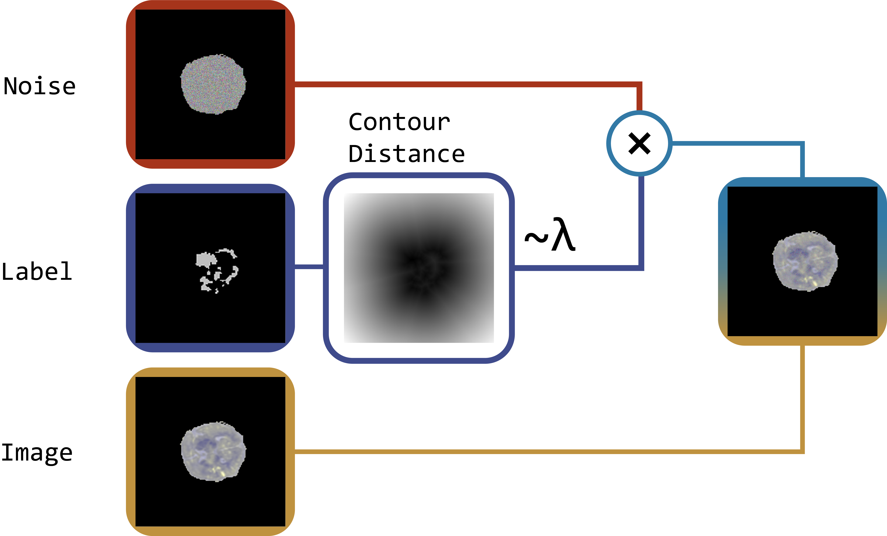
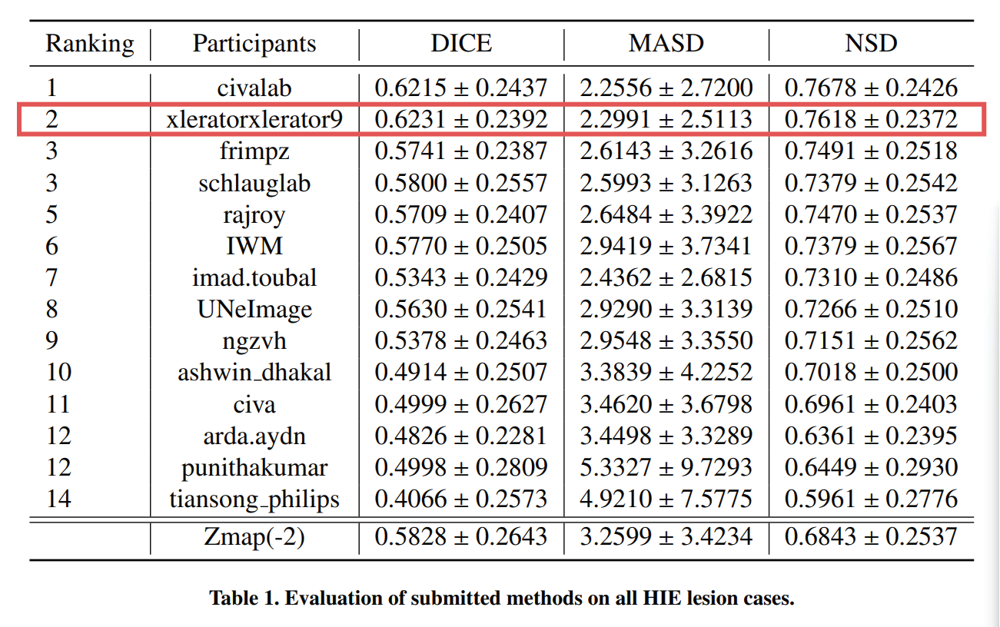

# LADP: Label Aware Denoising Pretraining for Lesion Segmentation

The training scrips and algorithm docker container source code for the LADP alpgorithim.

# Overview
At its core, LADP is a denoising pre-training technique (based on the procedure outlined in [DDP](https://arxiv.org/pdf/2205.11423.pdf)) where we incorporate label information. The input images are implanted with varying levels of noise based on stochastically sampled regions of interest surrounding lesioned areas, whose size is proportional to the size of the lesion. 


# Installation
## Prerequisites
- Download [BONBID-HIE](https://zenodo.org/records/8104103) dataset and unzip it. Original data will be converted by [`preprocessing.py`](utils.py)
- Install dependencies:
```python
pip install -r requirements.txt
```

### Dependencies
- PyTorch (>= 2.1, tested on 2.1.0+cu118)
- segmentation_models.pytorch
- ternausnet
- torchvision (>= 0.16.0, tested on 0.16.0+cu118)
- albumentations
- medpy


# Code Overview
- [`run_cv_training.py`](run_cv_training.py): pretrains then train models on BONBID-HIE
    - `--data_dir`: path to the raw features
    - `--n_folds`: number of trained models
    - `-denoising_transform_name`: Name of image nosing technique (choices: 'ladp', 'dae')
# Results
Our algorithm achieves the best Dice score and placed 2nd overall at the [1st BOston Neonatal Brain Injury Dataset for Hypoxic Ischemic Encephalopathy
(BONBID-HIE)
Lesion Segmentation Challenge](https://bonbid-hie2023.grand-challenge.org/)


# Docker Submission
Noted that when your algorithm is run on grand challenge `<local_path>/case1`
will be mapped to `/input`. Then a separate run will be made with
`<local_path>/case2` mapped to `/input`. This allows grand challenge to execute
all the jobs in parallel on their cloud infrastructure. For simplicity, you can
include one case in your test data when you test locally. The platform will
handle multiple cases. Predict should only handle one case.

Please follow these steps to run it on the local machine.

0. Change the working directory
```sh
cd docker
```

1. Build the docker
  ```sh
  ./build.sh
  ```
2. Test the docker
  ```sh
  ./test.sh
  ```

In test.sh, use the following command in order to generate the results locally
and test your codes:

```sh
docker run --rm \
    --memory="${MEM_LIMIT}" \
    --memory-swap="${MEM_LIMIT}" \
    --network="none" \
    --cap-drop="ALL" \
    --security-opt="no-new-privileges" \
    --shm-size="128m" \
    --pids-limit="256" \
    -v $SCRIPTPATH/test/:/input/ \
    -v $SCRIPTPATH/output/:/output/ \
    bondbidhie2023_algorithm
```
But for uploading algorithm docker to the grand challenge server, please use the codes that I provided in test.sh.

```sh
docker run --rm \
    --memory="${MEM_LIMIT}" \
    --memory-swap="${MEM_LIMIT}" \
    --network="none" \
    --cap-drop="ALL" \
    --security-opt="no-new-privileges" \
    --shm-size="128m" \
    --pids-limit="256" \
    -v $SCRIPTPATH/test/:/input/ \
    -v bondbidhie2023_algorithm-output-$VOLUME_SUFFIX:/output/ \
    bondbidhie2023_algorithm
```
3. Exporting docker ./export.sh 
Running ./export.sh, and submitting the generated zip file of the algorithm docker.

# Acknowledgements
This code is partly based on the open-source implementations from the following sources:
[CarveMix](https://github.com/ZhangxinruBIT/CarveMix/tree/main), [BONBID-HIE 2023 release for MICCAI 2023](https://github.com/baorina/BONBID-HIE-MICCAI2023)

